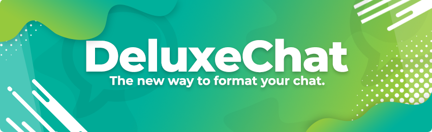

# DeluxeChat

## Description

**DeluxeChat** allows you to fully customize your chat what a powerful formatting system with support for adding tooltip messages when you hover over different chat sections!

## Features

* Hover tooltips.
* Click actions.
* Private messaging.
* Ability to toggle receiving private messages.
* Social spy.
* Unlimited chat formats.
* Chat filtering.
* BungeeCord compatibility for cross-server chat!​
* Multiple chat sections for different tooltips and click actions.
* [PlaceholderAPI](https://www.spigotmc.org/resources/placeholderapi.6245/) support.
* [TownyChat](http://towny.palmergames.com/townychat/) compatibility.

## Dependencies

* [PlaceholderAPI](https://www.spigotmc.org/resources/placeholderapi.6245/)

## Incompatible plugins

* [EssentialsChat/EssentialsXChat](https://www.spigotmc.org/resources/essentialsx.9089/)

