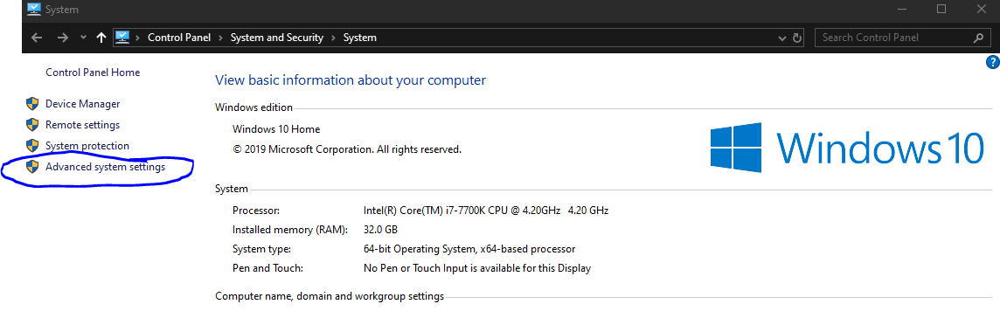

# Gradle

## Introduction

Gradle is a build tool, especially common among JVM languages as an alternative to another build tool, Maven. Gradle offers a few key benefits over maven however, including:

* Significant speed increases
* Simpler and more concise configuration
* Easier and more intuitive to extend


#### Wait a second, what's a build tool, and why should I use one?

A build tool as the name suggests, is a tool that helps you build your projects. Gradle in particular, offers a plethora of features, including dependency management, automation, testing, and of course, the actual compilation of your source code. We use build tools as they allow us to do really cool stuff, like merging two projects together, so they can use each other's code, and automatically running tests on your code to ensure semantics didn't break with your latest build.


### Installation

First, ensure that you've got the JDK. If not, head over to [AdoptOpenJDK](https://adoptopenjdk.net/), download it, and install it. From here on out, the guide will split into 3 sections, for Windows, Linux, and MacOS.

#### Windows

To install gradle on windows, you'll want to download the gradle binary, from their [releases page](https://gradle.org/releases). Move the zip somewhere you'll remember, as we'll come back to it. You'll now want to go to where you wish to install gradle; for me, that's `C:`. Create a folder called gradle, and extract the contents of the binary zip into the folder. The directory structure should look like this:


```text
.
`-- gradle
    `-- gradle-6.5
        |-- LICENSE
        |-- NOTICE
        |-- README
        |-- bin
        |-- init.d
        `-- lib
```


In file explorer, right click `This PC`, and select `Properties`.


A window will open, showing a brief overview of your computer's specifications. We're interested in the button on the left though, that says `Advanced system settings`. Click it.



Another window will then open up, called `System Properties`. Ensure you're in the `Advanced` tab, and then click `Environment Variables...` in the bottom right corner.


In the new window, under `System variables`, locate `Path`, and double click on it. Then, on the right side, click `New`, and write the path to your gradle installation, appending `\bin` onto the end.


Now, traverse through all the windows you've opened, making sure to apply all changes you've made. In order, that's buttons:  `OK` -&gt; `OK` -&gt; `OK`. 

#### MacOS

Unlike Windows, the installation process for gradle is far simpler on a mac, due to a nifty piece of software called homebrew. If you don't already have it, it's fairly simple to install. First off, open up a terminal, and execute the following command:

```text
/bin/bash -c "$(curl -fsSL https://raw.githubusercontent.com/Homebrew/install/master/install.sh)"
```

Once brew is installed, installing gradle is as simple as running the following:

```text
brew install gradle
```

#### Linux

Gradle may be available on your distro's official package manager \(apt, yum, etc\), but these are not official builds. Officially, gradle distributes to linux via SDKMAN!, and that's what we'll assume you'll use too. Like homebrew, SDKMAN! can be installed via a script, retrievable via curl \(so make sure you have curl installed!\). Run these commands to install SDKMAN!:

```text
curl -s "https://get.sdkman.io" | bash
source "$HOME/.sdkman/bin/sdkman-init.sh"
```


The second command updates your current terminal session, telling it that sdkman is now installed. The same effect can be achieved by simply opening a new terminal.


To test if it's been installed correctly, run `sdk version`, and ensure the output is something like `sdkman 5.0.0+51`. To install gradle with sdkman, run:

```text
sdk install gradle 6.5
```


At the time of writing, the latest gradle version is 6.5. Make sure to double check on the gradle website though, before running that command.


## Checking if gradle installed correctly

To test if your gradle installation was successful, open your command prompt, and run `gradle -v`.


```text
------------------------------------------------------------
Gradle 6.5
------------------------------------------------------------

Build time:   2020-06-02 20:46:21 UTC
Revision:     a27f41e4ae5e8a41ab9b19f8dd6d86d7b384dad4

Kotlin:       1.3.72
Groovy:       2.5.11
Ant:          Apache Ant(TM) version 1.10.7 compiled on September 1 2019
JVM:          1.8.0_181 (Oracle Corporation 25.181-b13)
OS:           Windows 10 10.0 amd64
```


## The importance of the gradle wrapper

Even though you just installed a local distribution of gradle, that's not actually the thing that's going to be building your projects. It's job is merely to provide the ability to initialise gradle projects, from there on though, the gradle wrapper takes over.

The gradle wrapper is essentially a portable version of gradle. There's 2 scripts, `gradlew` and `gradlew.bat`, which handle platform dependence issues. These invoke, and pass arguments to the wrapper jar, which populates the `.gradle` directory, with settings, and the actual gradle binary \(downloads it if it's not there\). You may be asking, what's the point of this? Why can't I just use the local installation I just spent ages installing? Well, as I mentioned before, the wrapper is a portable version of gradle, and that's important, because portability is a huge bonus on collaborative projects. It's very useful to be able to fork a project, and being able to build it without needing to manually install a bunch of third party dependencies.

