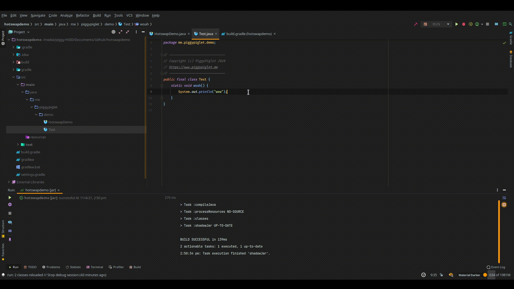
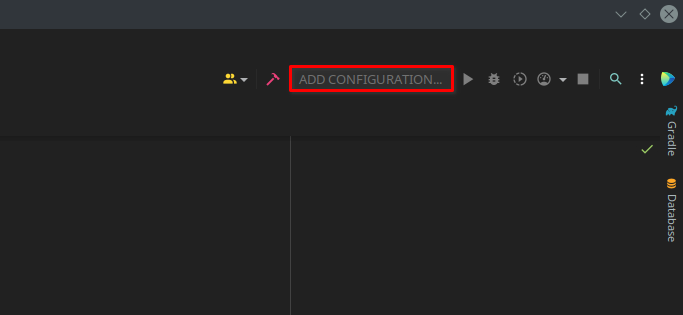

# Hot Swapping

## Info

Hot swapping (in relation to software) refers to the process of seamlessly swapping out executing code in a live environment.



The default JVM (HotSpot) actually has support for this out of the box, albeit a severely limited implementation. You're only able to swap out method bodies, which while still better than nothing, is really not all that useful.

Thomas Wuerthinger (who you may know from [GraalVM](https://www.graalvm.org)) proposed a solution in [JEP 159](https://openjdk.java.net/jeps/159); enhanced class redefinition. While it didn't completely solve the lacklustre hot swap implementation in HotSpot, it significantly improved upon it. The JEP proposed the ability to hot swap the following things, along with method bodies (this logic was to be untouched):

* Adding/removing methods
* Adding/removing static and instance fields
* Adding supertypes

These features would allow you to effectively redefine a class's structure at runtime (hence the proposal title, "Enhanced Class Redefinition"). This JEP was prototyped in a separate project called DCEVM, which is currently maintained to this day by [HotswapProjects](https://github.com/HotswapProjects). This is the tool that this guide attempts to explain how to install, and effectively use.

## Install

As of right now, DCEVM only supports java 8 & java 11. These days, DCEVM is distributed in an OpenJDK build called TravaOpenJDK, which bundles DCEVM and HotswapAgent (a tool which is essential for this to all work nicely).

### Windows

First step for a windows install is to download the relevant TravaOpenJDK build. If you're wanting java 8, that'll be from here: [https://github.com/TravaOpenJDK/trava-jdk-8-dcevm/releases](https://github.com/TravaOpenJDK/trava-jdk-8-dcevm/releases), and for java 11: [https://github.com/TravaOpenJDK/trava-jdk-11-dcevm/releases](https://github.com/TravaOpenJDK/trava-jdk-11-dcevm/releases)

For this tutorial, we'll be using [the java 11 build](https://github.com/TravaOpenJDK/trava-jdk-11-dcevm/releases/download/dcevm-11.0.10%2B6/java11-openjdk-dcevm-windows.zip). Extract the zip where ever you want. It's probably a good idea to place it where your other java installations are. I'll personally be placing mine in `C:\Program Files\Java`.



That's basically the entire install done. There's a little more setup you'll need to do in your IDE, but we'll get back to that later.

### Unix

We'll be using SDKMAN! to install TravaOpenJDK on Unix (Linux/macOS). I also recommend using this tool to install pretty much anything java related, whether it be java itself, alternative jdks, gradle, maven, etc.

Installing SDKMAN! is very easy, simply paste the following command into your terminal:

```bash
curl -s "https://get.sdkman.io" | bash
```

Then close the terminal, and proceed to open a new one. Upon running `sdk version` in the new terminal, something like this should be returned:

> ```
> sdkman 5.0.0+51
> ```

If an error is thrown, or nothing happens at all, I recommend joining [HelpChat](https://discord.gg/helpchat) for assistance.&#x20;

If successfully installed, you'll then want to list the java installations, which can be done via `sdk list java`. A list like the following should be outputted:

```bash
================================================================================
Available Java Versions
================================================================================
 Vendor        | Use | Version      | Dist    | Status     | Identifier
--------------------------------------------------------------------------------
 AdoptOpenJDK  |     | 16.0.0.j9    | adpt    |            | 16.0.0.j9-adpt      
               |     | 16.0.0.hs    | adpt    |            | 16.0.0.hs-adpt      
               |     | 11.0.10.j9   | adpt    |            | 11.0.10.j9-adpt     
               |     | 11.0.10.hs   | adpt    |            | 11.0.10.hs-adpt     
               |     | 11.0.9.hs    | adpt    |            | 11.0.9.hs-adpt      
               |     | 8.0.282.j9   | adpt    |            | 8.0.282.j9-adpt     
               |     | 8.0.282.hs   | adpt    |            | 8.0.282.hs-adpt     
               |     | 8.0.275.hs   | adpt    |            | 8.0.275.hs-adpt     
 TravaOpenJDK  |     | 11.0.9       | trava   |            | 11.0.9-trava        
               |     | 8.0.232      | trava   |            | 8.0.232-trava       
================================================================================
```

As you can see, at the bottom, we have the TravaOpenJDK builds. To install one of these, you'll simply want to grab the corresponding identifier and put it into the sdk install command like so: `sdk install java <identifier>`, e.g. `sdk install java 11.0.9-trava`. Please do not rely on the above table, it is merely an example. You should check the latest version yourself via the list command.

While installing, it will prompt you on whether you wish to set trava as the default java installation, meaning the `java` command will refer to your trava install from there on. I recommend against setting trava as your default JDK.


If you accidentally set trava as your default, don't worry. You can set the default via `sdk default java <identifier>`, e.g. `sdk default java 11.0.10.hs-adpt`.


## Setup

The setup/usage section of this guide will only cover usage in IntelliJ. If you're using Eclipse or NetBeans, then I simply recommend switching to IntelliJ. Eclipse and NetBeans are frankly primitive compared to IntelliJ these days, and there's no justifiable reason to use them over IJ. If you're stubborn though, and wish to stick with your current IDE, I'm fairly sure a similar setup to what follows can be achieved in both, however I do not know how to achieve it, and I will not assist you in doing so.\</rant>

As far as I'm aware, it's not possible to configure IntelliJ's SDKs without having a project open, so you'll need to open a project to find the following option, or even create a new project for the express option of configuring the following.

When a project is opened, you'll want to go to File > Project Structure (ctrl + alt + shift + s).

.png>)

Under the **Platform Settings** separator on the left side panel, click SDKs.

.png>)

In here, we're able to add the TravaOpenJDK installation we made earlier. This can be done by clicking the + in the top left (alt + insert).

.png>)

Ideally IntelliJ will pick up any JDKs you have installed, like in the picture above, but in the event it doesn't, you'll have to manually add them. Simply click `Add JDK...`, and navigate to the installation directory of your JDK. Following this tutorial, for Linux, that'd be `~/.sdkman/candidates/java/11.0.9-trava`, and for Windows: `C:\Program Files\Java\dcevm-11.0.10+5`. I assume macOS is the same as Linux, but I haven't tested this.

Once added, it should look something like this:

.png>)

I recommend including "DCEVM" somewhere in the JDK name so you can easily differentiate between your regular JDK, and DCEVM.

## Usage

**Prerequisites:**

* A project in IntelliJ
* A run configuration for said project ([minecraft](https://wiki.helpch.at/piggys-barn/java/how-to-run-your-minecraft-server-s-in-intellij), [standalone](https://wiki.helpch.at/piggys-barn/java/how-to-run-your-program-in-intellij))


I recommend also configuring your build tool to automatically output the jar in your run configuration's working directory. Instructions on how to do that with gradle are [here](https://wiki.helpch.at/piggys-barn/java/cheat-sheet#gradle-jar-directory).


Using DCEVM from here on is relatively simple. Click your run configuration in the top right to open up an editing modal, from which you can select DCEVM as the configuration's JRE.

.png>)

.png>)


Depending on what java version you're targeting here, you'll need to do one of two things.

### 8

Add the following VM option: `-javaagent:<dcevm path>/lib/hotswap/hotswap-agent.jar`. Make sure to replace the path with yours, e.g.\
Linux: `-javaagent:/home/piggy/.sdkman/candidates/java/8.0.232-trava/lib/hotswap/hotswap-agent.jar`\
Windows: `-javaagent:C:\Program\ Files\Java\dcevm-11.0.10+5\lib\hotswap\hotswap-agent.jar`

### 11

Add the following VM option: `-XX:HotswapAgent=core`

### Finalising

Hit apply, ok, then run your configuration, but instead of clicking the play button (shift + f10), click the debug button (shift + f9).

.png>)

This will execute your configuration in debug mode, which will allow us to hot swap. Try change some code, you can then make it live via Run > Debugging Actions > Reload Changed Classes.

.png>)


For productivity purposes, I highly recommend assigning a keybind to this action. As you can see from that screenshot, I personally chose alt + r.

